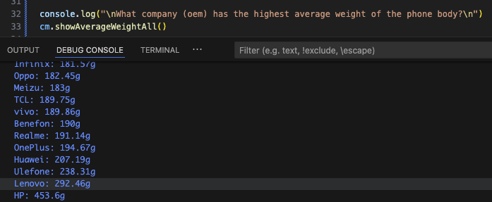
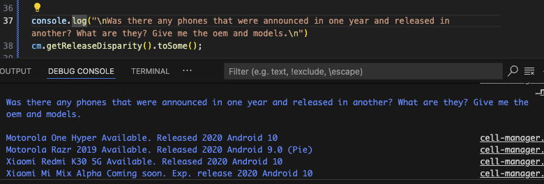
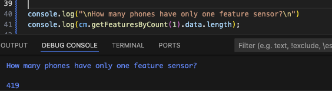
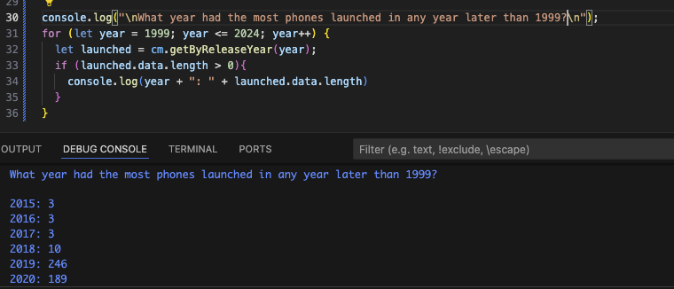

# Cell Data Parser

This TypeScript project parses and queries mobile device data from a CSV file. It provides a `Cell` class representing each phone entry, and a `CellManager` class to manage, filter, and analyze collections of cells.

## Project Structure

- `cell.ts` – Defines the `Cell` class, which encapsulates mobile device properties.
- `cell-manager.ts` – Provides methods to import, filter, and process `Cell` instances.
- `main.ts` – Example usage of `CellManager`.
- `resources/cells.csv` – CSV data source.

## Features

- Parse CSV data into structured objects.
- Filter phones by:
  - OEM
  - Launch status (e.g., cancelled, discontinued)
  - OS platform (e.g., Linux)
- Compute averages (e.g., body weight).
- Get full or summary outputs.
- Find intersections (e.g., phones that are both Motorola and Linux-based).

## Review
### Why Typescript?
I picked Typescript Version 5.8.3 because Javascript is the most popular language and I figure I should learn some of it. I went with Typescript over Javascript, though, in hopes of some more familiarity and ease with OOP.

### How Does it Handle?
TypeScript supports object-oriented programming with classes, interfaces, and inheritance. It handles file ingestion using Node.js modules like fs, and supports typical control structures such as conditionals (if, switch), loops (for, while), and functions/methods. Assignment uses let, const, or var. Exception handling uses try-catch, and unit testing is done with libraries like Jest. 

### Libraries
I used fs for reading files, csv-parse to convert CSV data into objects, and Jest for testing.

## Queries
### What company (oem) has the highest average weight of the phone body?
  
### Was there any phones that were announced in one year and released in another? What are they? Give me the oem and models.
  
### How many phones have only one feature sensor?
  
### What year had the most phones launched in any year later than 1999? 
